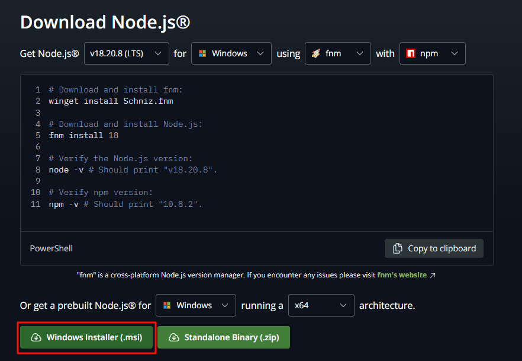
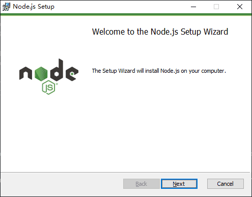
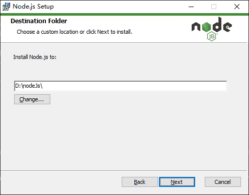
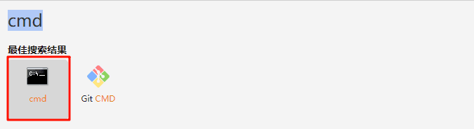
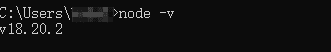
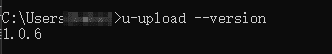
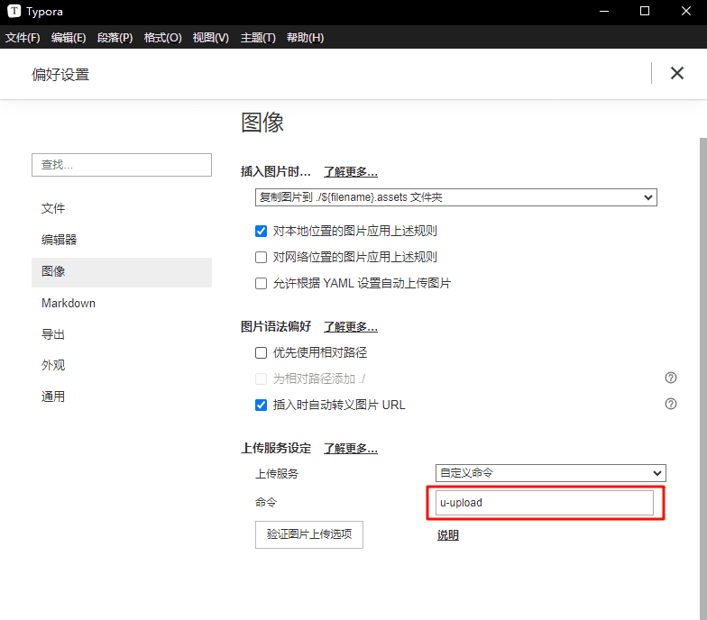

:::info 描述
使用命令行工具调用服务接口上传文件并返回链接地址
命令行工具开源地址: [GitHub](https://github.com/xiaou66/utools-picture-command)
:::

## 环境要求 

需要安装 node 环境

### 安装教程

:::info 安装说明
安装 nodeJs 有很多种方式这里就介绍最简单的方式
:::

1. 进入 nodeJs [下载页面](https://nodejs.org/en/download)
2. 选择 LTS 版本下载



3. 将下载安装包打开 下一步-> 同意 -> 下一步 -> 选择目录 -> 下一步





4. 安装完成

## 安装图床命令行工具

1. 在 utools 主输入框中输入 cmd, Mac 版本是 终端



2. 检查 node 环境的版本

```shell 
node -v
```



3. 安装命令行工具

```shell
npm install -g @xiaou66/picture-command
```

4. 检查安装是否成功

```shell
u-upload -h
```



## 命令行工具应用

### Typora


