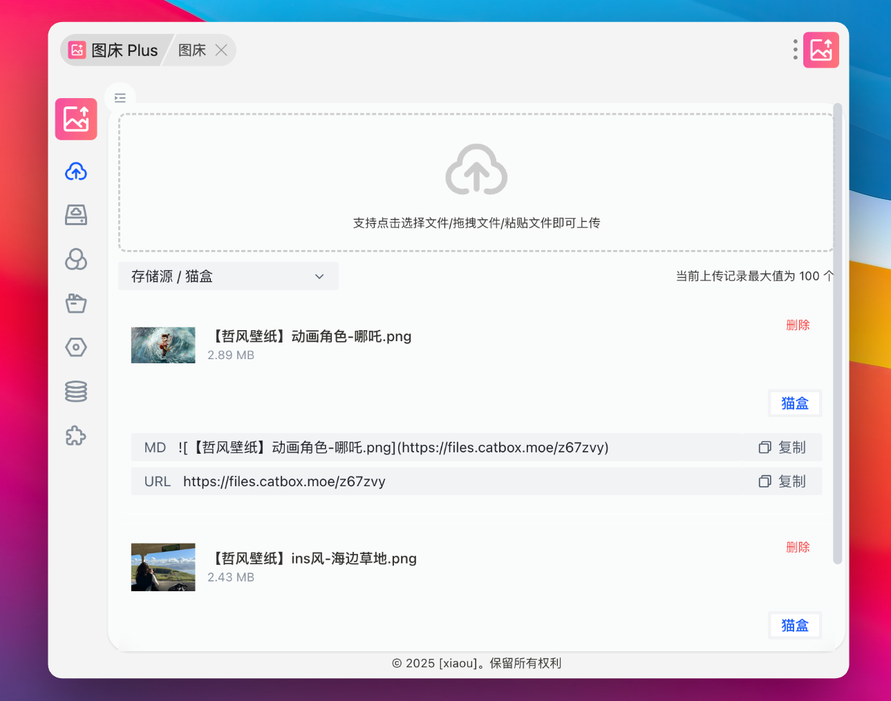
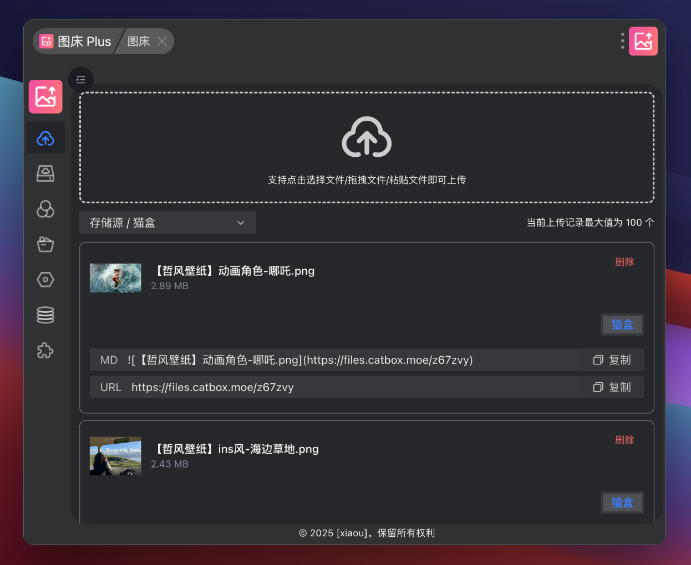

### 简介

主要是为了解决图片及文件上传后方便使用及后续管理使用的一款 uTools 插件, 并支持市面上大部分上传存储源

- [阿里云 OSS](https://www.aliyun.com/product/oss)
- [腾讯云 COS](https://cloud.tencent.com/product/cos)
- [七牛云对象存储 Kodo](https://www.qiniu.com/products/kodo)
- [又拍云云存储 USS](https://www.upyun.com/products/file-storage)
- [sm.ms](https://smms.app/)
- [LskyPro+](https://www.lsky.pro/)
- [ImgURL](https://www.imgurl.org/vip/manage/upload)
- [GitHub](https://github.com/)
- [EasyImage 2.0](https://github.com/icret/EasyImages2.0)
- [Chevereto V4](https://chevereto.com/)
- [CatBox](https://catbox.moe/)
- [16 图床](https://111666.best/)
- aws-S3 协议

