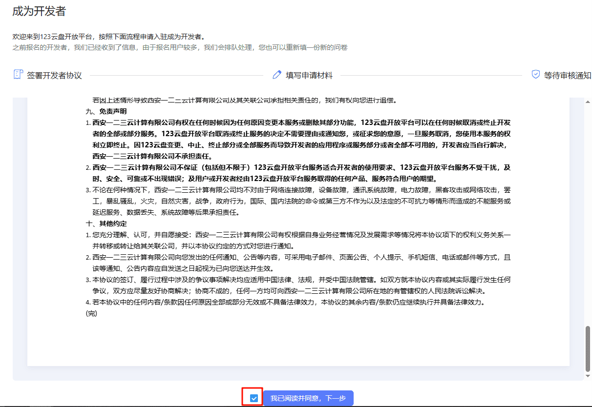
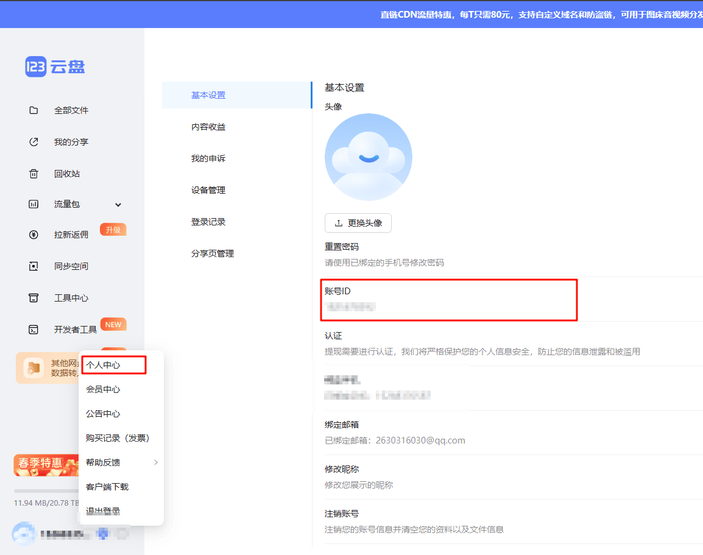
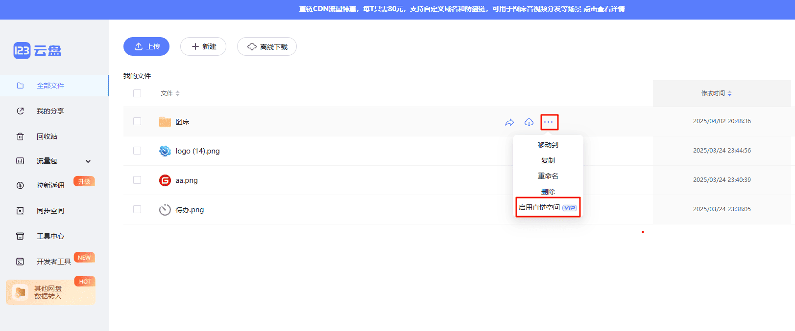
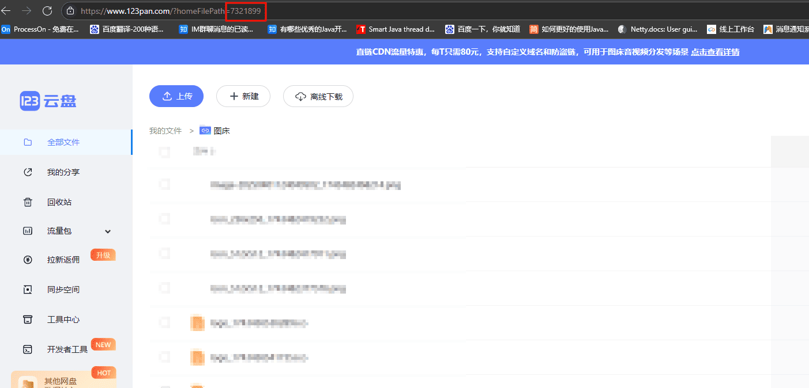
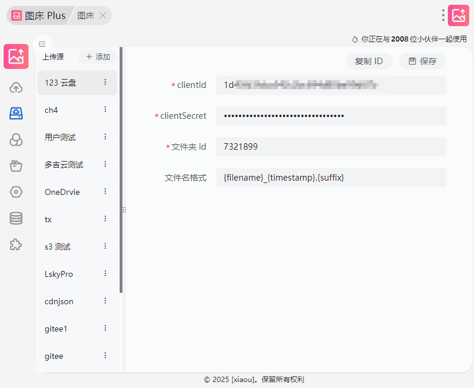

:::info 提示
123盘作为存储需要VIP才可以开通直链空间
:::

## 配置教程

1. 申请开发者 key, [申请地址](https://www.123pan.com/developer)



2. 下一步填写必要信息

云盘 UID 获取方式



对接123云盘 OpenAPI 的应用场景简述

```text
用于管理图片和视频文件
```

目标用户简述

```text
本产品专为需要高效管理图片和视频文件的用户设计，提供直观的界面和强大的功能，帮助用户轻松组织、分类和查找多媒体内容。
无论是摄影师、设计师，还是普通用户，都能通过我们的工具快速整理和访问他们的视觉资产，提升工作效率和创作灵感。
```

对接的产品或服务是否已上线
```text
已上线
```


3. 等待邮件, 审核通过会给你发邮件，邮件包含了: clientId 和 clientSecret

4. 对文件夹启用直链空间



5. 获取文件夹 id



6. 填写必要参数到 图床 Plus


