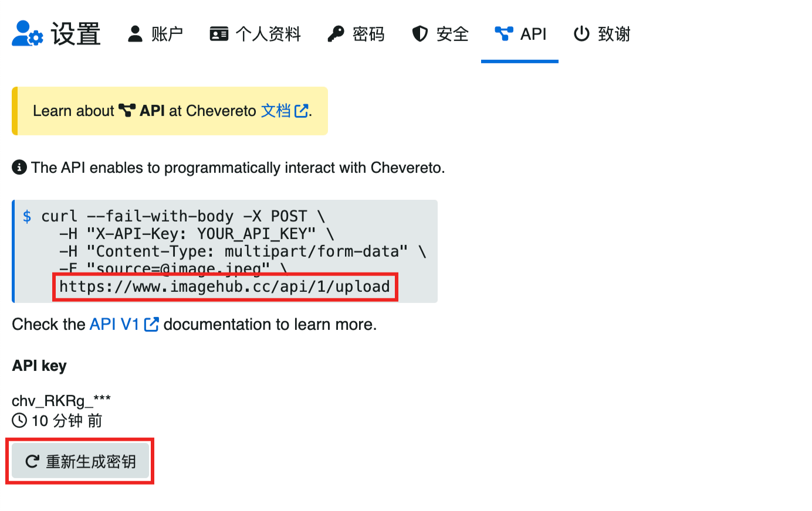

::: info 说明
[开源地址](https://v4-docs.chevereto.com) 一个使用 PHP 语言，采用 Laravel 框架开发的一款 Web 图片管理程序 并不是一定要自建, 也有自建后提供一些服务
:::

## 已知图床地址
- [imagehub](https://www.imagehub.cc/) 已经不能通过 api 上传了
- [黑猫图床](https://img.hmvod.cc) API URL: https://img.hmvod.cc/api/1/upload

## 配置

::: info
这里将只将 API 调用的方式如何配置到 图床 Plus 插件中, 不包含 chevereto 的配置
:::

1. 进入设置


2. 进入 API 设置



如上图
api 地址为: https://www.imagehub.cc/api/1/upload
密钥: 点击生成后可以复制

3. 进入图床 Plus 插件配置即可


## 自建

### Docker 部署

```shell
docker run -d \
  --name chevereto \
  -p 80:80 \
  -e CHEVERETO_DB_HOST=database \
  -e CHEVERETO_DB_USER=chevereto \
  -e CHEVERETO_DB_PASS=user_database_password \
  -e CHEVERETO_DB_PORT=3306 \
  -e CHEVERETO_DB_NAME=chevereto \
  -e CHEVERETO_MAX_POST_SIZE=2G \
  -e CHEVERETO_MAX_UPLOAD_SIZE=2G \
  -v /var/www/html/images/ \
  ghcr.io/chevereto/chevereto:latest
```
