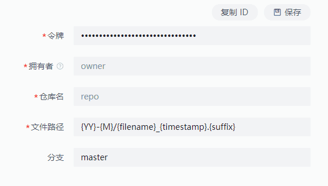

::: info 说明
Gitee 作为图床并很不是很建议.
1. 必须是开源的仓库，会导致所有人都可以找到你的仓库
2. 也不稳定取决于 Gitee 官方是否会检查
:::

## 配置
1. 申请私人令牌 [申请地址]( https://gitee.com/profile/personal_access_tokens)

2. 点击提交并输入账号密码生成令牌

3. 将令牌复制到 图床Plus 插件令牌输入框中

4. 创建存储仓库

5. 将对应的仓库配置到 图床Plus 插件中

1. 如果是中文用户名称一定要拥有者一定要输入路径是的名称比如图上仓库上显示小u, 但是拥有者要输入 lovexiaou
2. 仓库名就是拥有者后面名字如图上为 demo

