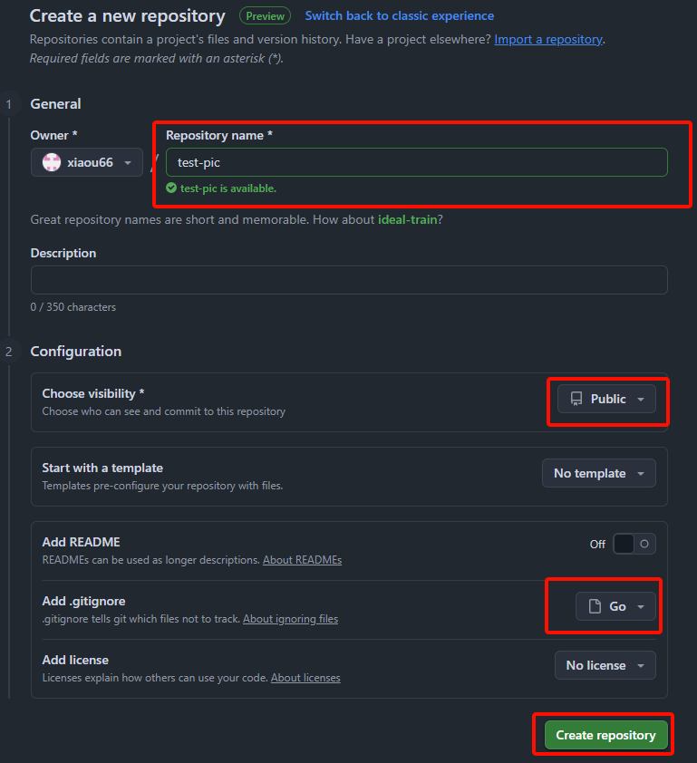
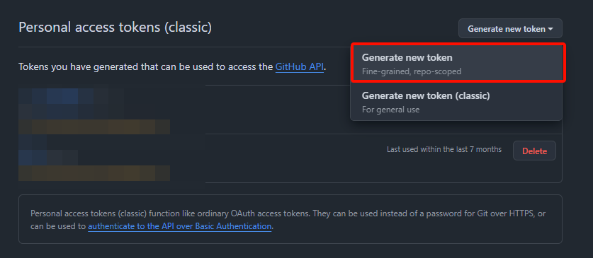
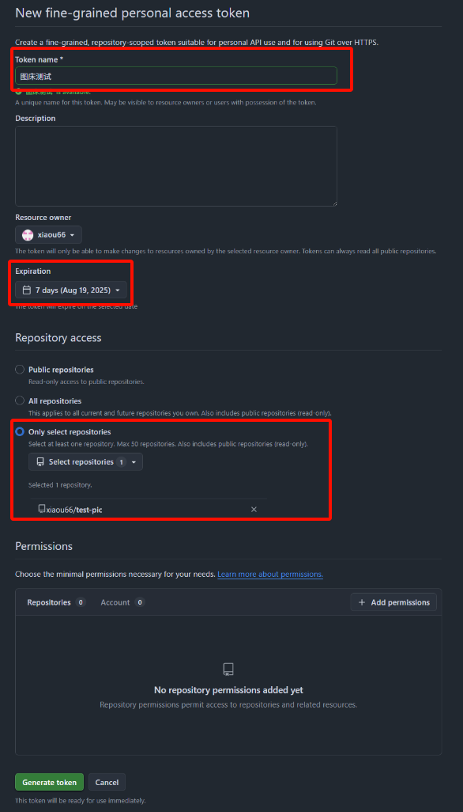
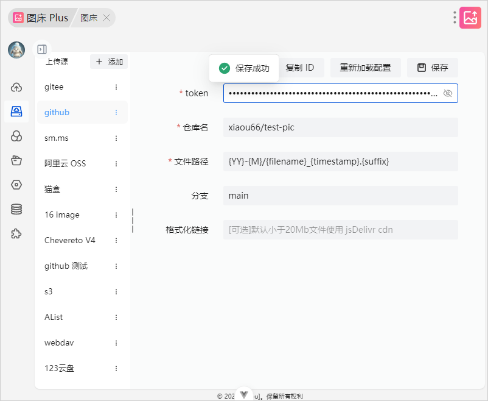

## 注册账号

[注册地址](https://github.com/signup)

## 创建仓库并填写仓库名称

[创建仓库](https://github.com/new)

1. add .gitignore 配置可以随便选择一个模板
2. 仓库可见性 (Choose visibility) 必须是 Public





## 获取账号令牌

[获取令牌地址](https://github.com/settings/tokens)

1. token name 填写一个对 token 备注即可用于区分 token
2. Expiration 过期时间可以根据需求填写，长时间使用可以选择 No expiration
3. Repository access 选择 only select repositories 选择这项并选择刚刚的仓库





将获取到令牌填写到插件的 token 配置中



## 格式化链接配置说明

:::info
默认 < 20MB 文件会使用 jsdelivr CDN 即使用值
:::

```text
https://fastly.jsdelivr.net/gh/{project}@{branch}/{uploadPath}
```
#### 变量说明

::: info
使用变量一定要用 {} 包裹 比如 \{project\}
:::

| 变量         | 描述   |
|------------|------|
| project    | 仓库名  |
| branch     | 分支   |
| uploadPath | 上传路径 |
