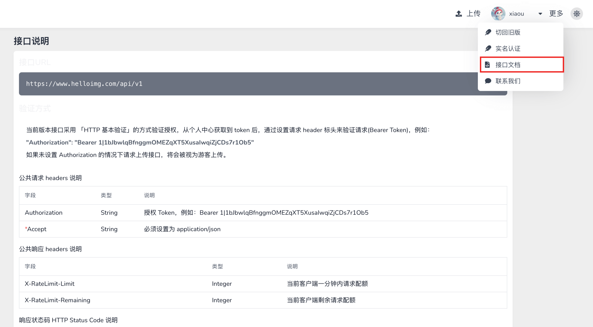
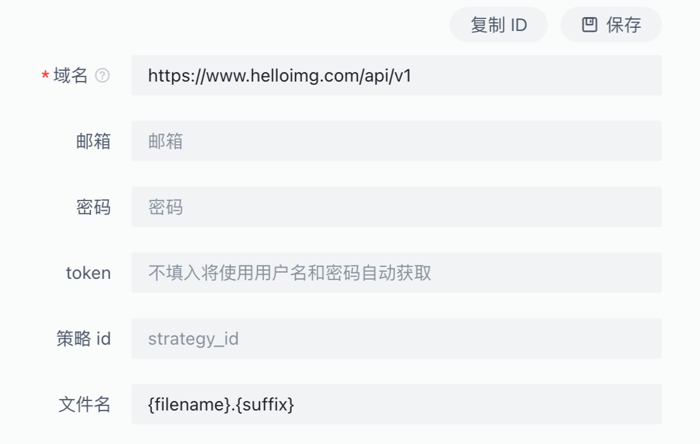
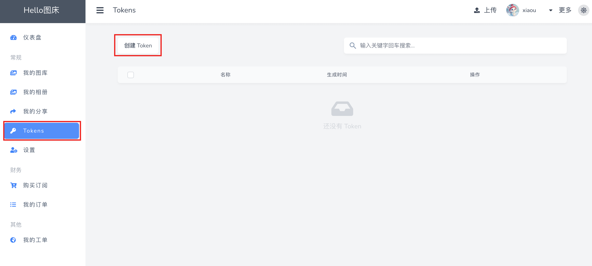
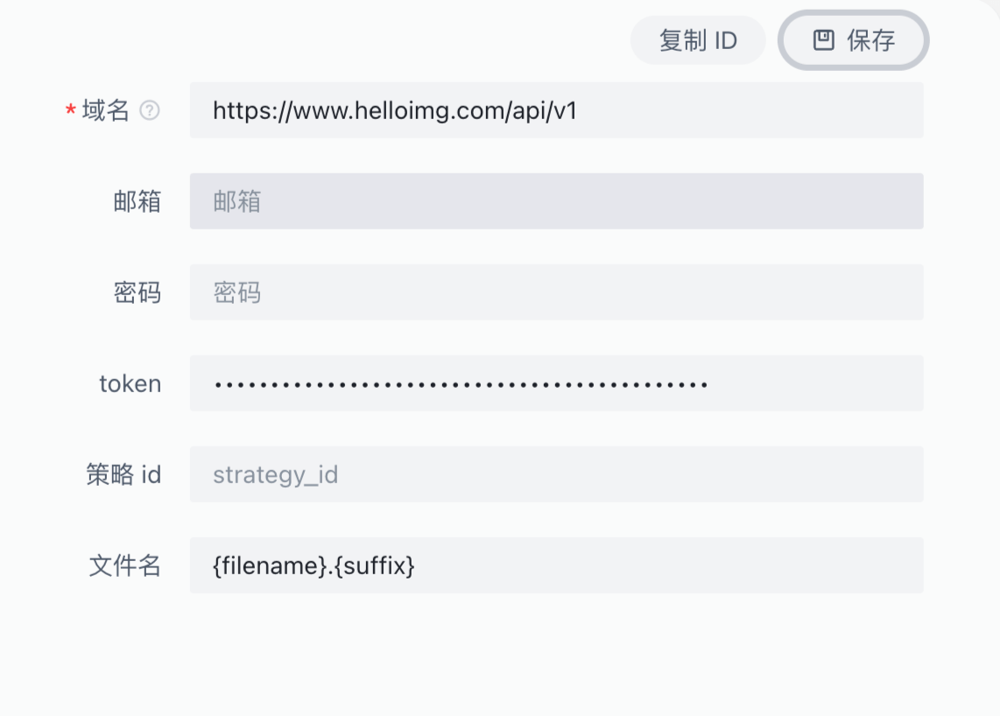

::: info 说明
[开源地址](https://docs.lsky.pro/) 一个使用 PHP 语言，采用 Laravel 框架开发的一款 Web 图片管理程序，中文名：兰空图床
并不是一定要自建, 也有自建后提供一些服务
:::

## 已知图床地址
- [Hello 图床](https://www.helloimg.com/)

## 配置

:::info
这里举例使用 hello 图床情况
:::

1. 打开开发接口文档

2. 在图床 Plus 配置接口URL https://www.helloimg.com/api/v1

3. 邮箱和密码 或 token 输入二选一即可, token 需要手动调用接口生成, 这里如果使用邮箱和密码插件会自动获取 token
> 注意 hello 图床未开放获取 token 接口可以自己在后台生成

生成后填写到 截图 Plus 中

