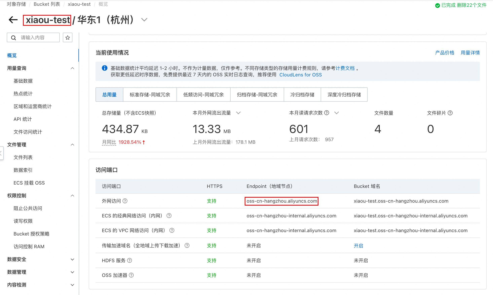

::: info 说明
阿里云对象存储服务OSS（Object Storage Service）：是一款高可靠、安全、低成本、高扩展性的分布式对象存储服务。它可以帮助用户轻松地存储和管理海量非结构化数据，如图片、音视频文件、文档等。并且OSS存储的资源还提供免费域名访问。
:::

### 开通服务

开通 OSS 对象存储服务，[网址](https://www.aliyun.com/product/oss)：（新人免费试用3个月）

### 计费情况
[网址](https://www.aliyun.com/price/product?spm=a2c4g.11186623.0.0.c1011f9ajb2UrX#/oss/detail)

存储费用： 0.12元/GB/月
文件上传到OSS费用：免费
同地域ECS服务器内下载 OSS 资源费用：免费
外出流量费用：闲时0.25元/GB（00:00-8:00），忙时0.50元/GB（8:00-24:00）
如果这方面需求量比较大的话，按量付费就不太划算了，购买OSS资源包比较合适。
如果测试使用，充个几块钱就够用了。

### 配置

#### 进入控制台
1. 点击「 管理控制台」进入控制台存储OSS页面后，点击创建 Bucket（水桶）

2. 配置 Bucket（水桶）
Bucket名称：桶名称不能重名
地域服务器：选择一个就近的即可
存储类型：标准存储
存储冗余类型：本地冗余存储
读写权限：公共读（文件写操作需要验证身份，读操作可以匿名访问）
所属资源组：默认资源组

3. 查看创建好的 Bucket，以及 地域 (Endpoint)：

这里将可以获取到 Bucket 名称 和 地域

如上图的话
地域: oss-cn-hangzhou
Bucket名称: xiaou-test
可以配置到 图床 Plus 插件中

4. 创建用户名密码（AccessKey），并授权

先点击控制台页面右上角的用户头像，然后再点击 AccessKey 管理。

点击创建用户：

填写用户名称，并勾选 OpenAPI 调用访问

创建成功后，页面会显示该用户的账号和密钥（子用户的账号密码）：
AccessKey ID（账号）：xxxxxxxxx
AccessKey Secret（密钥）：xxxxxxxxx
填写到 图床 Plus 中

5. 为子用户开通 oss 相关权限默认子账号是没有任何权限的

如果不想使用该账号，点击用户后面的删除选项即可：

6. 图床 Plus 插件可以单击保存按钮

7. 选择上传存储源

