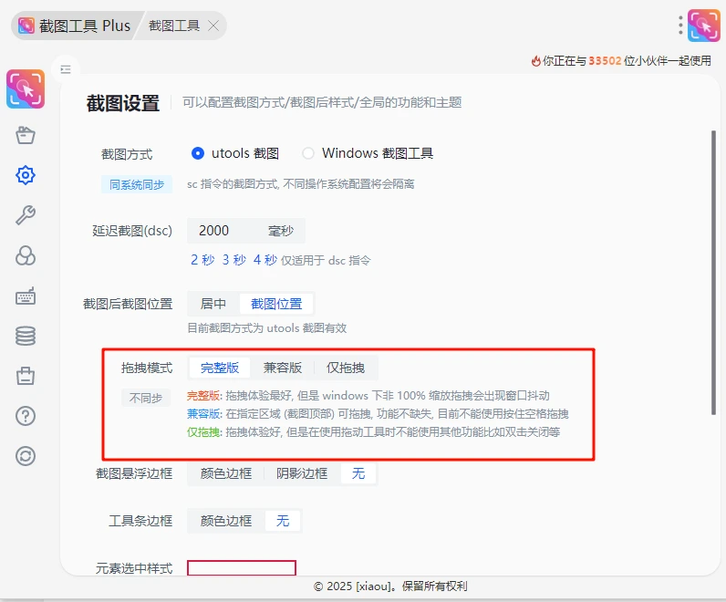
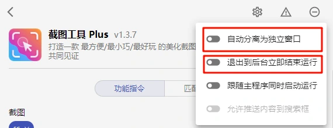
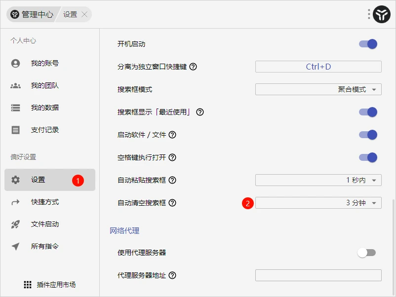
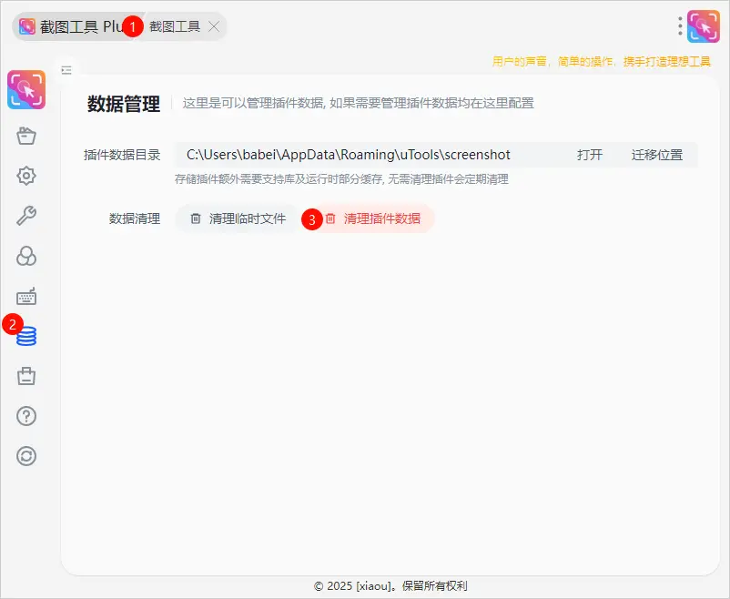

## 在 windows 下拖动出现窗口抖动
::: info 出现场景
这种情况出现在屏幕缩放不在 100% 下的系统, 原因是 uTools 使用 Electron 本身的 BUG
:::

1. 使用「截图工具」指令进入插件的配置页面找到拖拽模式的配置项, 不要选择 完整版 可以按需选择兼容和仅拖拽

## 截图完成, 当前调用的插件已完全退出, 无法响应

1. 检查当前插件是否被设置为「退出到后台立即结束运行」或 「自动分离为独立窗口」请取消掉.

2. 如果上面的操作没有作用请 utools 设置中将 自动恢复搜索形态不要设置为「立即」

## MacOS 截图插件只能截桌面壁纸, 无法正常截图

没有授权 utools 屏幕录制权限, 因为需要录屏权限才可以获取对电脑进行截图

## 完全卸载插件
:::info 提示
此方法卸载插件可以将插件所有数据全部移除, 包括插件产生的所有数据
:::

1. 需要在使用「截图工具」指令进入配置页面，然后进入「数据管理」菜单, 最后单击清理数据

