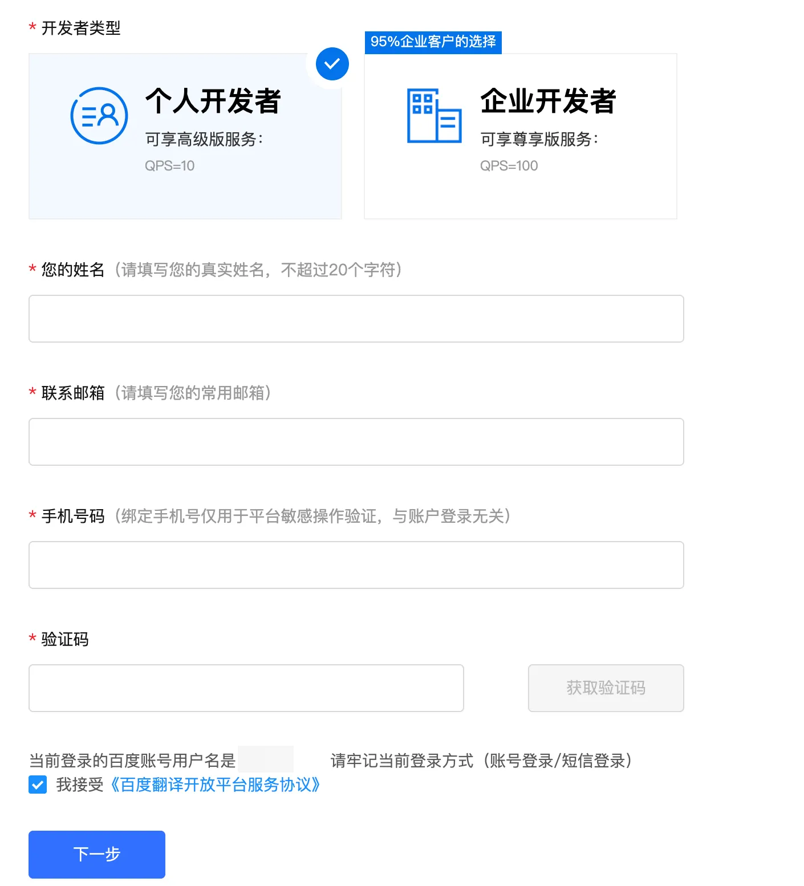
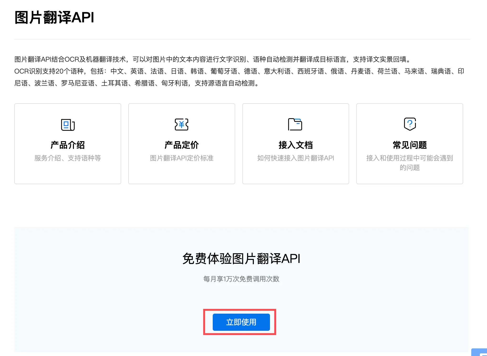
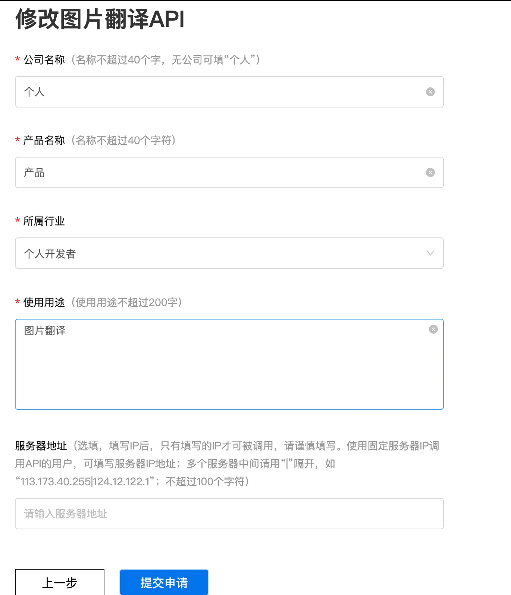
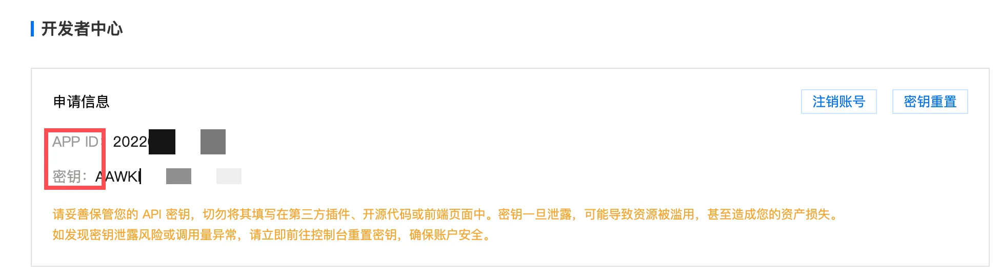
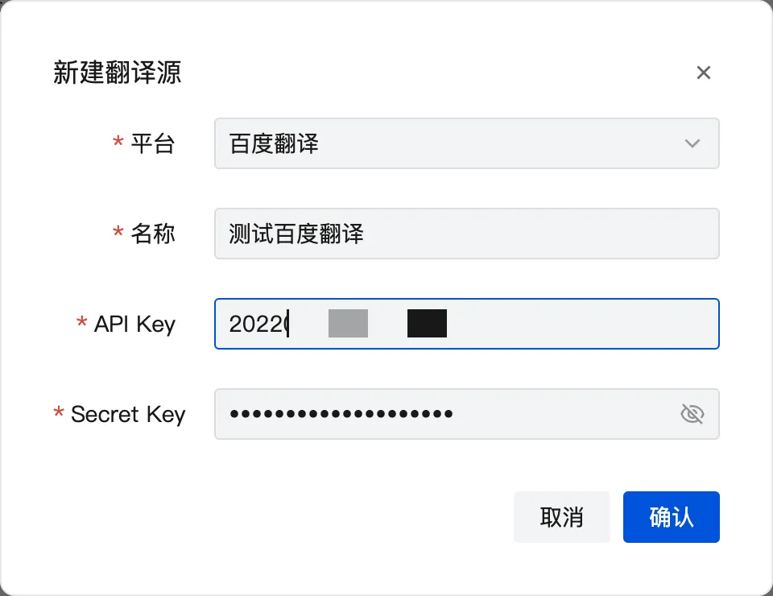

# 工具使用

## 美化工具

- 支持对截图进行添加好看背景/阴影/圆角
- 可以修改截图的与背景的对其方式和当前和背景填充大小
- 默认修改的配置是根据当前使用的场景实时保存的

## 翻译工具

### 百度翻译
1. 登录 [百度翻译](https://fanyi-api.baidu.com/) 站点, 登录百度账号

2. 登录后将鼠标悬浮到用户名称上出现下拉菜单点击开发者信息

3. 如果还没有申请开发者可以填写资料申请, 已申请跳过

4. 然后打开 [图片翻译服务文档](https://fanyi-api.baidu.com/product/22) 点击「立即使用」按钮, 根据情况填写申请理由

5. 然后再访问 [开发者中心](https://fanyi-api.baidu.com/manage/developer) 页面复制 APP ID 和 密钥 到插件中

- **名称**: 可以自己取一个好听的名称
- **API KEY**: 对应百度翻译的 APP ID
- **Secret Key**: 对应百度翻译的密钥

6. 单击确定后看一下列表前面可以选择当前添加翻译源如果没有请单击单选按钮

