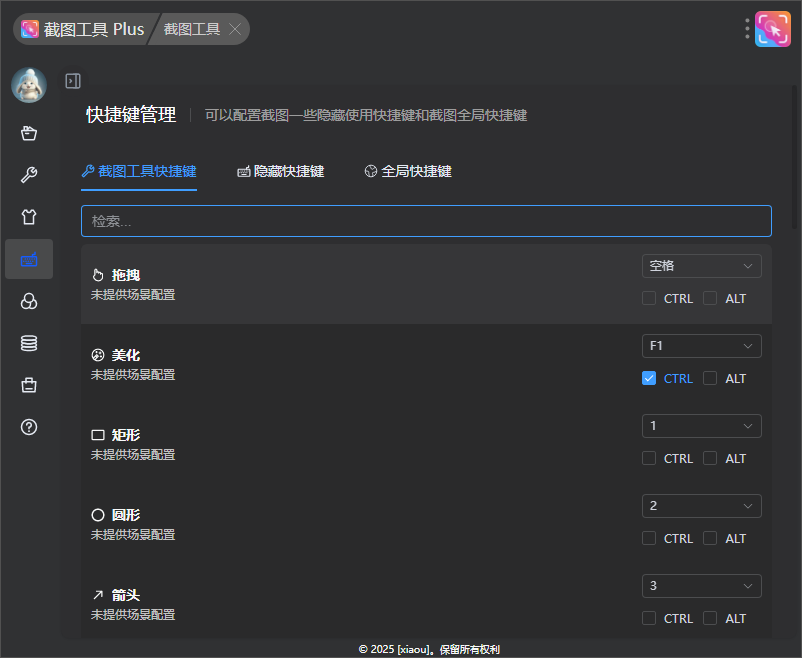
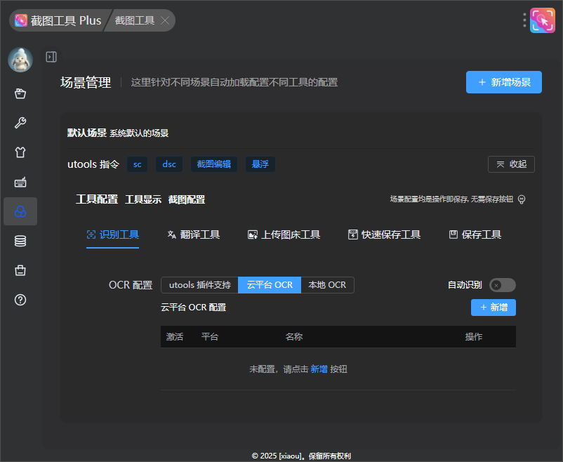

## v3.0.0

### UI & 配置更新

1. 截图工具 Plus 改名为 兔灵截图工具 Plus
2. 「截图设置」与「工具设置」的菜单进行合并

3. 「样式设置」样式调整为 tab 切换的方式

4. 「快捷键管理」新增截图快捷键设置并且支持 alt 快捷键设置

### 场景配置功能

1. 移除每一个工具配置功能仅保留需要额外配置工具
2. 移除每一个工具可配置是否保存配置的功能，现在每一个工具配置均自动保存
3. 新增工具显示配置, 可以调整工具是否显示的工具条上

### 工具条
1. 工具条样式整体调整
2. 工具条支持进行拖拽
3. 工具快捷键显示样式进行调整

### 截图工具调整

1. 除布局工具的外其他的滑块均支持鼠标滚动调整大小
2. 所有设置颜色地方均支持自定义调整颜色
   - 设置颜色支持渐变色设置
3. 矩形、圆型、箭头、画笔工具支持线型选择
4. 文本工具支持字描边、斜体、加粗、下划线功能
5. 美化工具重做，支持图片背景和更多设置参数
5. 新增更多工具，主要收纳了直接生效的工具
6. 新增快速保存工具，使用快捷键直接将截图进行保存到预设位置默认是下载路径

### bug 修复

1. 修复 右键菜单可能出现遮挡的问题
2. 修复 OCR Pro 插件无法跳转的问题
3. 修复 截图过大后水印不加载的问题
4. 修复 序号工具 序号不居中的情况

## v1.3.10

### 功能更新

1.  [会员功能] 场景: 新增截图时自动暂停音频功能, 用户在截图的同时将自动暂停视频播放, 保证截图前和截图后视频连贯性。

2. 快键键管理: 新增 插件内的全局快键键设置, 可以帮助用户截取 uTools 插件界面的截图

3. 美化: 新增 插件会员标识

### 功能优化

1. 优化用户一封信的在暗色模式下的显示
2. 底层依赖库 leafer 升级到 v1.5.3 版本

### 问题修复

1. 重大问题修复: 解决 windows 下 125% 缩放下出现模糊的问题, 但是不能使用美化工具
2. utools 全局快键键使用: 修复 快键键使用 xsc 指令出现 utools 输入框一闪的情况, 需要重启增强截图生效

### 问题修复

## v1.3.9

1. 修复 文件盒子无法删除和选择数字显示错误的问题

## v1.3.8

### 功能更新

1. 样式配置: 新增了系统窗口样式配置，用户可以通过此配置去掉系统窗口自带的阴影和边框。

2. 文件盒子: 新增批量删除功能，用户可以一次性删除多个文件。
3. 文件盒子: 新增复制功能，方便用户快速复制所需文件。

4. 保存工具: 新增自动保存上一次使用的路径功能，提升用户体验
5. 保存工具: 现支持自定义文件名称，方便用户灵活命名文件

### 功能优化

1. 截图适配: 优化在 utools 32 位版本的基本截图功能使用，之前该版本在使用截图时会出现闪退问题。
2. 底层框架：从 LeaferJS v1.0.7 升级到 v1.5.0，提升了应用的稳定性和性能。

### 问题修复

1. 截图功能：修复了在多屏幕环境下、且屏幕缩放不一致时出现的模糊问题。
2. 截图功能：优化了缩放时截图模糊的情况，提高了图像清晰度。
3. 文件盒子：修复了在给图片添加新标签时无法保存的问题。
4. 图床上传: 修复 window 系统下无法使用服务上传的问题。
