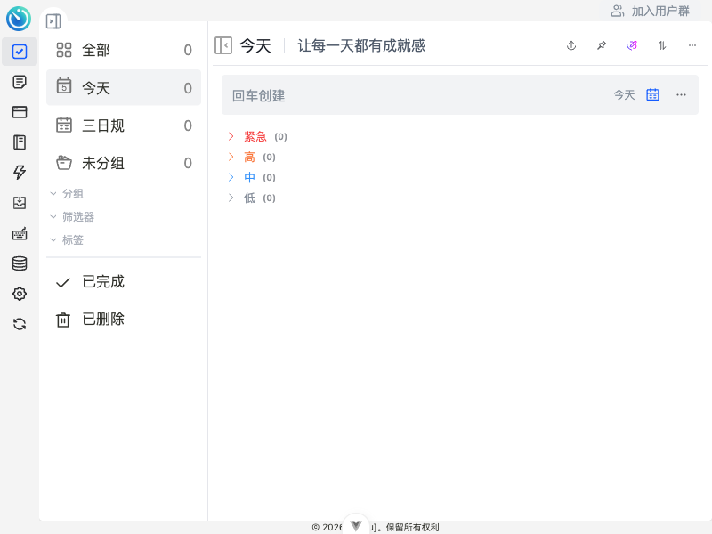
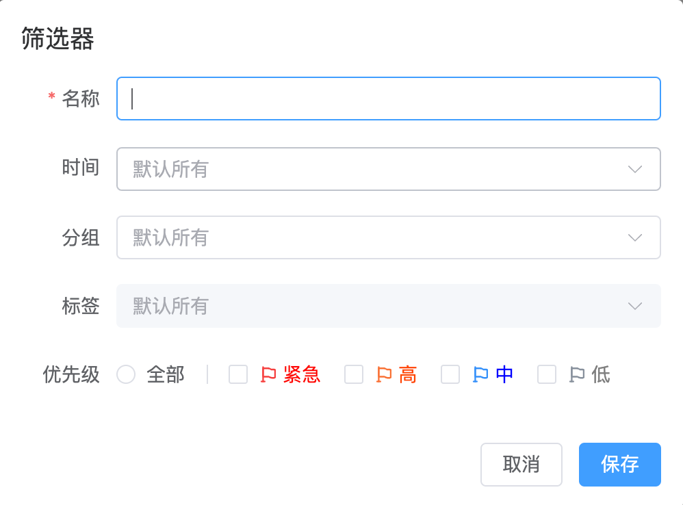

# 分组、标签与筛选

当任务数量变多后，只靠“今天”和“全部”很难保持清晰。分组、标签和筛选用于把任务整理成更容易查看的范围。

## 分组

分组（承载任务的项目或主题空间）适合表示任务“属于哪里”。例如：

- 产品迭代
- 学习计划
- 家庭事务
- 客户项目

在左侧“分组”区域可以查看已有分组。分组内还可以使用文件夹组织多个相关分组，适合项目较多的场景。

## 标签

标签（给任务添加的特征标记，可用于筛选）适合表示任务“有什么特征”。例如：

- 高优先级
- 等待回复
- 外出处理
- 需要沟通

一个任务可以有多个标签。标签适合表达临时属性，不一定要和项目结构绑定。

## 筛选器

筛选器用于保存一组查看条件。它适合把常用查询固定下来，之后直接点击查看。

适合创建筛选器的情况：

- 经常查看同一类任务。
- 需要按时间、状态、标签或分组组合查看。
- 想为某个工作流程保存固定入口。

## 搜索

当你记得任务标题、描述或关键词时，可以使用搜索快速定位任务。搜索适合跨分组查找历史任务。

## 分组、标签、筛选怎么配合

| 工具 | 回答的问题 | 示例 |
| --- | --- | --- |
| 分组 | 任务属于哪里 | “产品迭代”“家庭事务” |
| 标签 | 任务有什么特征 | “高优先级”“等待回复” |
| 筛选器 | 现在只想看哪一批任务 | “本周高优先级任务” |
| 搜索 | 某个任务在哪里 | 搜索任务标题或关键词 |

## 使用建议

- 不要为每个小任务都新建分组，分组更适合稳定项目或主题。
- 标签数量可以少而明确，避免同义标签太多。
- 常用组合条件再保存为筛选器，临时查看可以直接搜索或切换标签。

如果任务已经整理清楚，但需要定时提醒、周期执行或拆分步骤，可以继续阅读 [提醒、重复任务与子任务](./remind-repeat-subtask.md)。
