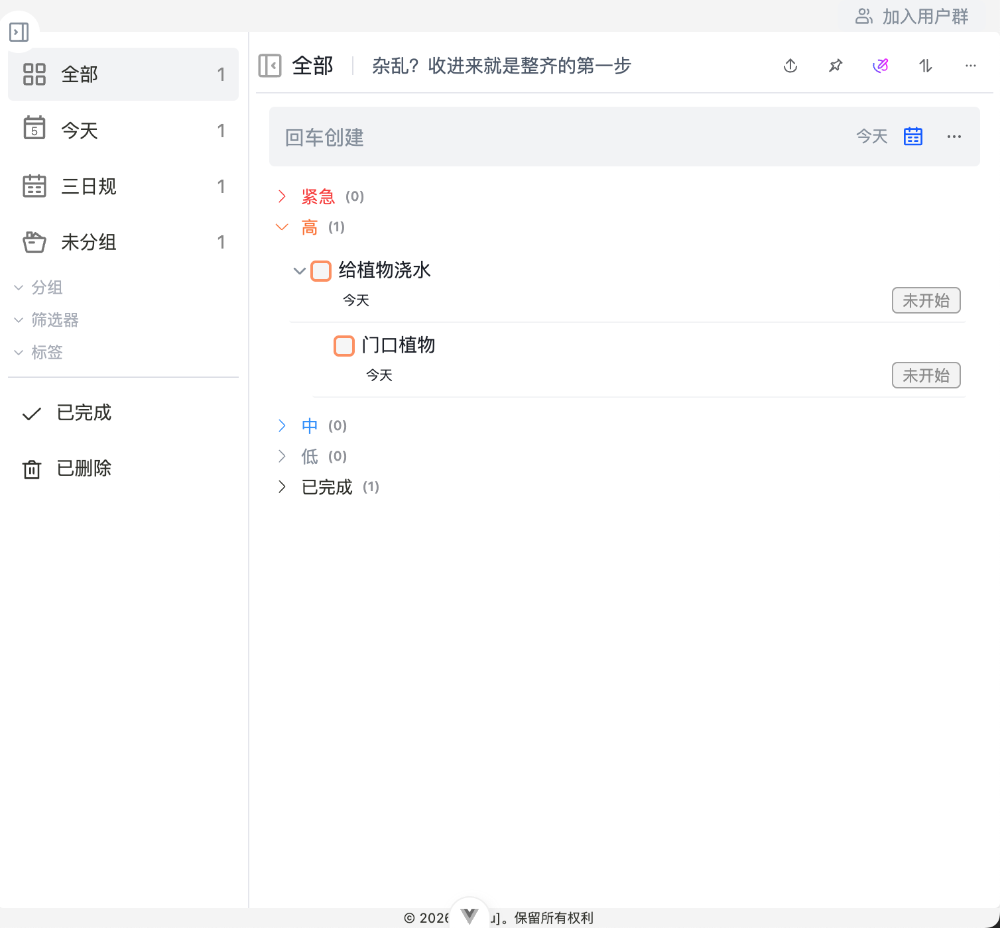

# 提醒、重复任务与子任务

提醒、重复任务和子任务用于处理更复杂的任务。它们分别解决“不想忘记”“周期执行”和“拆分执行”的问题。

## 提醒

提醒用于在指定时间提示你处理任务。它适合不能错过的事项，例如会议、截止时间、定时检查。

设置提醒时建议确认：

- 提醒时间是否早于任务截止时间。
- 是否真的需要提醒，避免通知过多。
- 任务描述中是否已经写清楚到时要做什么。

::: warning 注意
提醒触发依赖实际运行环境。普通浏览器预览不能完整代表 uTools 运行时，因此本文只说明使用场景和设置思路。
:::

## 重复任务

重复任务（按固定周期自动生成或延续的任务）适合周期性事项。例如：

- 每天习惯打卡
- 每周复盘
- 每月缴费
- 固定周期巡检

如果一件事会周期性出现，优先考虑重复任务，而不是每次手动重新创建。

## 子任务

> 拖拽任务到一个任务的下面也可以让任务成为任务的子任务

子任务（把一个大任务拆出来的较小执行步骤）适合拆分复杂事项。例如“发布新版本”可以拆成：

1. 整理更新内容。
2. 完成测试验证。
3. 准备发布说明。
4. 发布并观察反馈。

子任务能让大任务更容易推进，也方便确认当前卡在哪一步。

## 什么时候应该拆分

| 情况 | 建议 |
| --- | --- |
| 一句话就能完成 | 保持普通任务 |
| 需要多个步骤 | 拆成子任务 |
| 每隔一段时间都要做 | 设置重复任务 |
| 到点必须处理 | 设置提醒 |

## 使用建议

- 只给真正有时间要求的任务设置提醒。
- 周期性事项使用重复任务，减少手动维护。
- 超过三步才能完成的任务，建议拆成子任务。
- 子任务写成可执行动作，例如“确认名单”，不要写成模糊目标。

需要在桌面上快速查看待办时，可以继续阅读 [待办小组件](./widget.md)。
