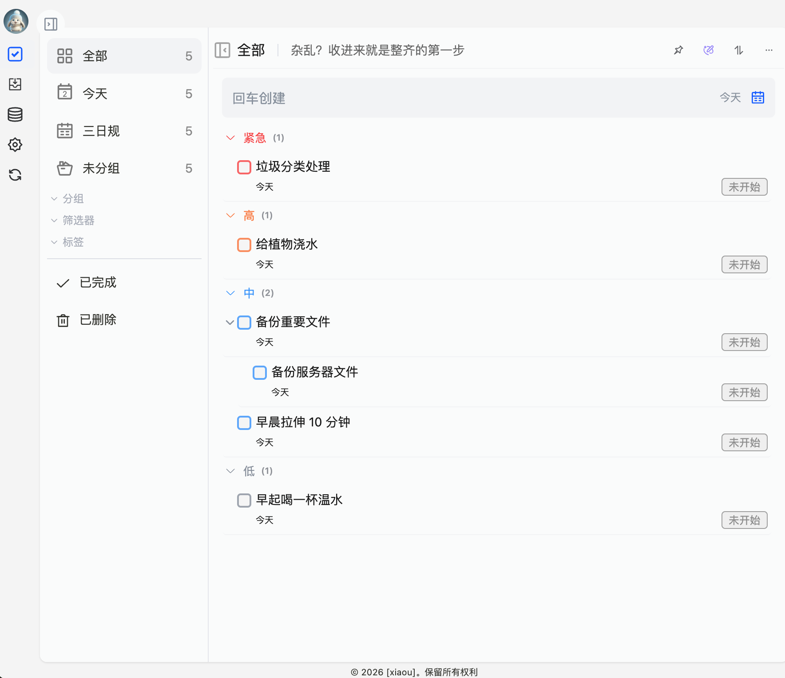
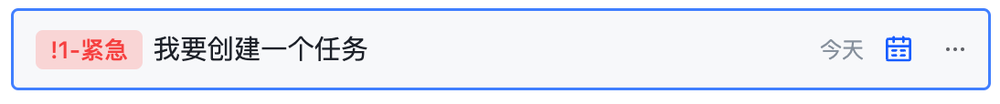
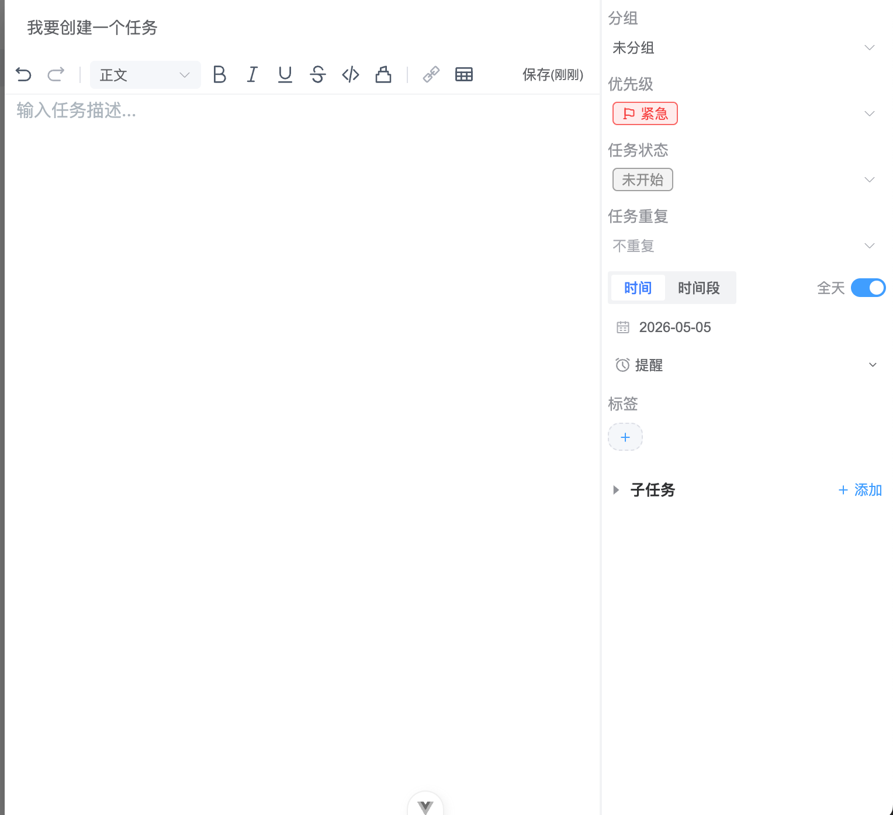
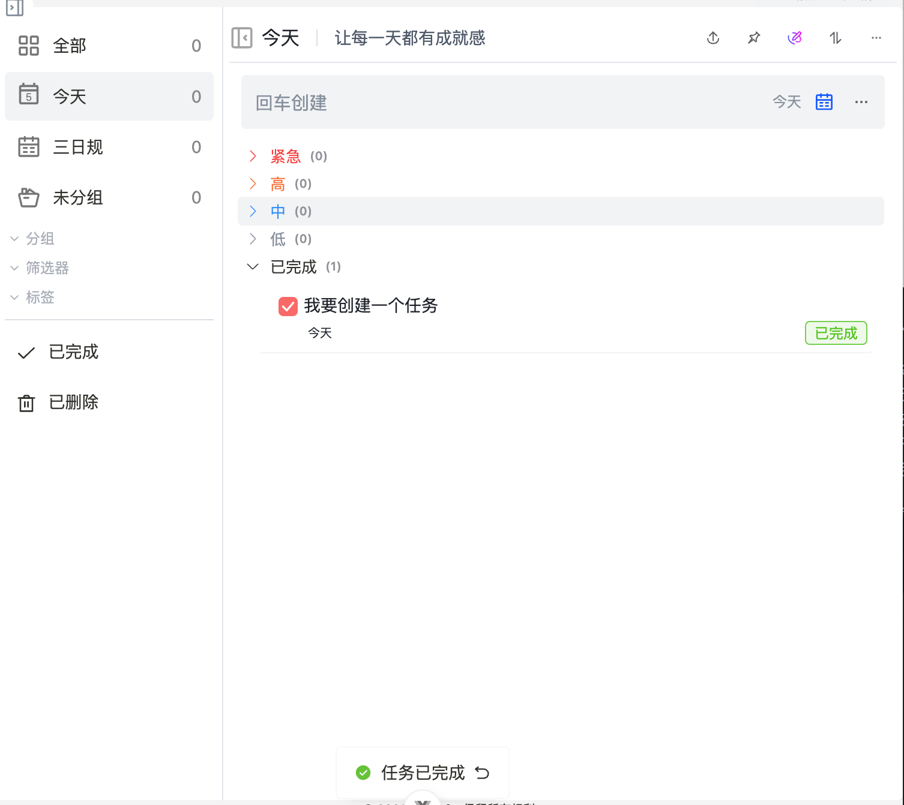
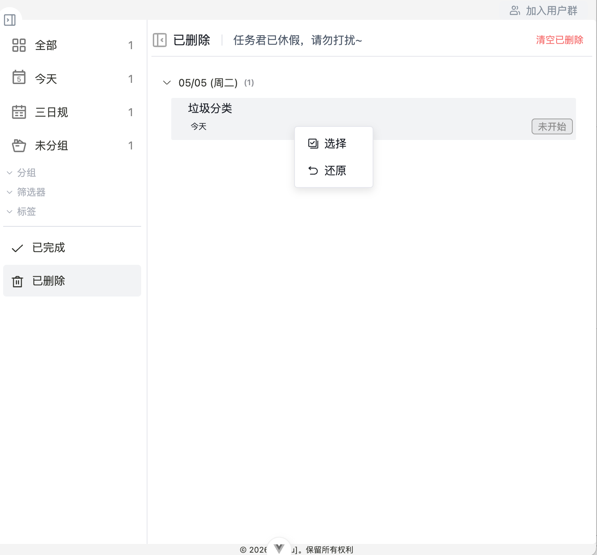

# 任务列表

任务列表是处理待办事项的主要区域。读完本文后，你可以新建任务、补充任务信息、完成任务，并从已完成或已删除分类中回看任务。

## 新建任务

> 创建任务时候可以在输入框输入 ～, !, # 来选择 分组, 优先级，标签

1. 进入工作台左侧菜单的“任务”。
2. 选择“今天”“全部”“未分组”或某个分组。
3. 在任务输入区域填写任务标题。
4. 根据需要补充时间、标签、分组或更多设置。
5. 确认后，任务会进入当前分类对应的任务范围。

如果只是临时记录一件事，先填写标题即可。等任务变明确后，再补充详情、标签或时间。

## 编辑任务

点击任务后，可以进入任务详情或编辑区域。常见可编辑内容包括：

- 任务标题：用于快速识别任务。
- 任务描述：用于记录背景、步骤或补充说明。
- 时间信息：用于安排开始时间、截止时间或提醒。
- 分组和标签：用于后续整理和筛选。
- 优先级或状态：用于判断处理顺序。

::: info 说明
任务描述适合放执行细节，不建议把所有信息都塞进任务标题。标题保持短，后续检索和列表浏览会更清晰。
:::

## 完成任务

任务完成后，点击任务前的勾选区域即可标记完成。已完成任务不会丢失，可以在“已完成”分类中查看。

适合保留已完成任务的场景：

- 回顾当天完成了哪些工作。
- 检查项目任务是否已经全部处理。
- 需要向他人同步工作进展。

## 删除与恢复

不再需要的任务可以删除。删除后的任务会进入“已删除”分类，便于处理误删情况。

删除前建议先确认：

- 任务是否还需要保留为记录。
- 任务是否属于某个项目复盘材料。
- 任务是否只是暂时不处理，是否更适合调整时间或分组。

## 使用建议

- 临时想到的事项先快速创建，避免中断当前工作。
- 项目任务建议放入对应分组，减少和日常待办混在一起的情况。
- 信息较多的任务，用描述和子任务承载细节。
- 定期查看“已完成”和“已删除”，保持任务列表清爽。

下一步可以阅读 [视图模式](./view-mode.md)，根据任务数量和使用场景选择更合适的查看方式。
