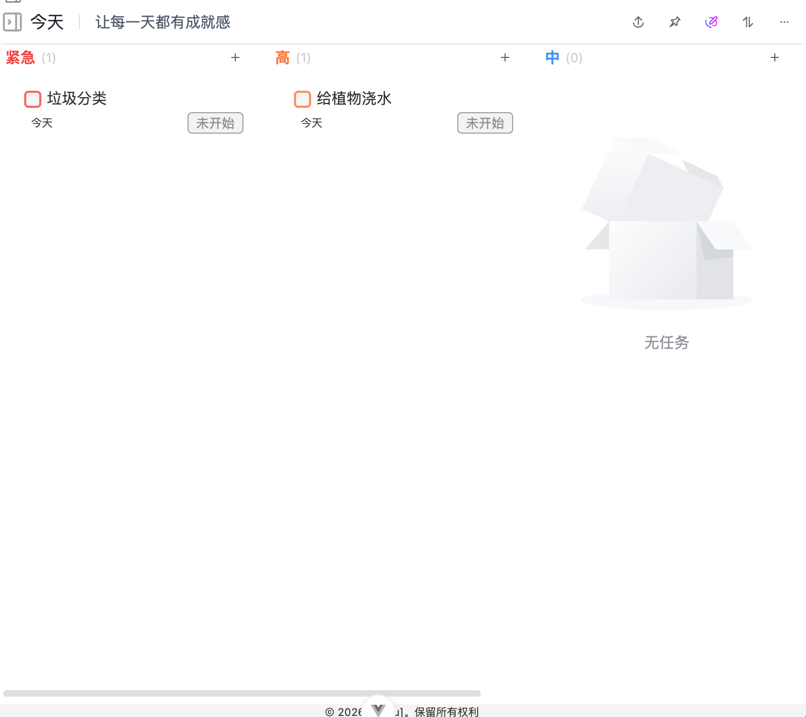
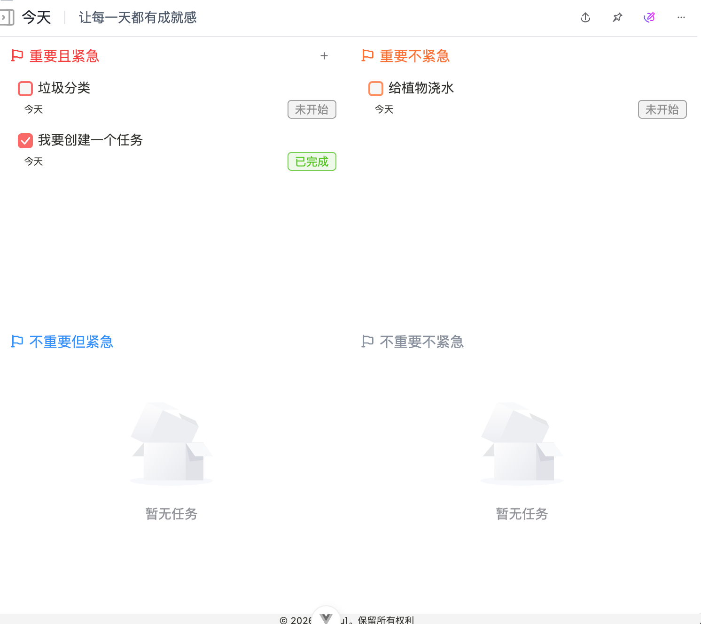
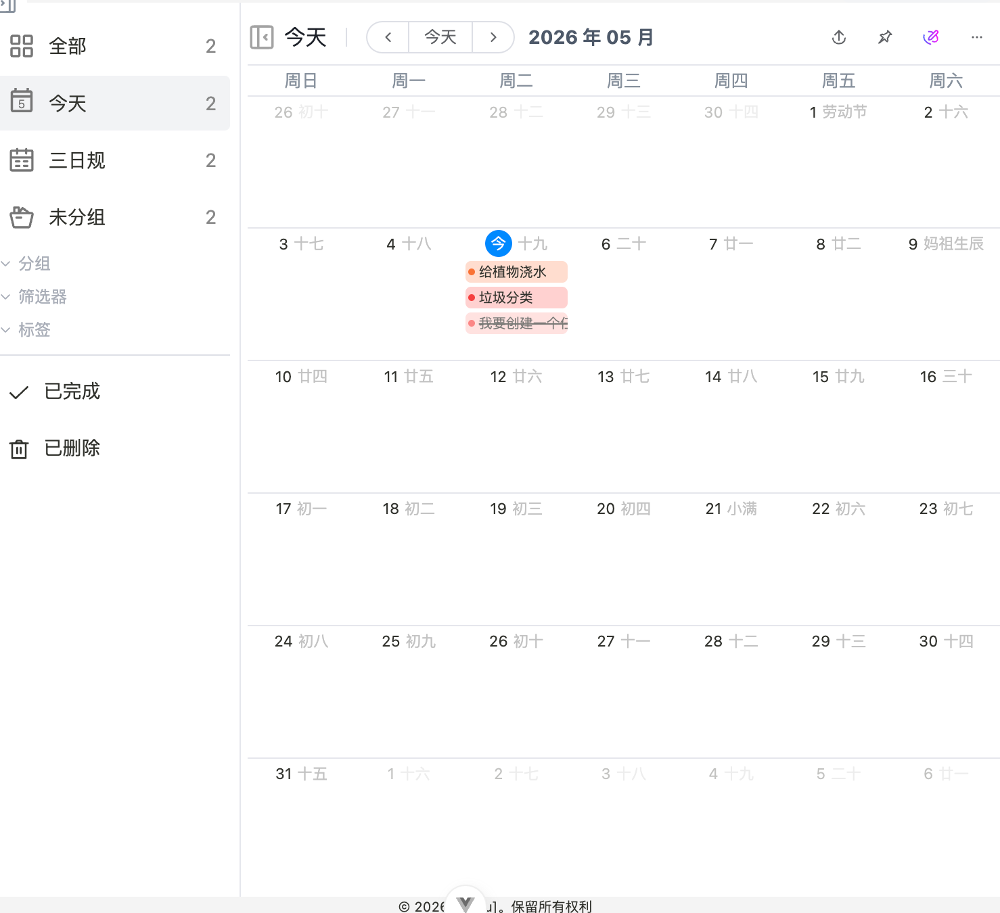

# 视图模式

视图模式用于改变同一批任务的呈现方式，不会改变任务本身。读完本文后，你可以根据当前目标选择列表、网格、四象限或日历视图。

## 列表视图

列表视图适合日常处理任务。它强调顺序和效率，适合快速查看、勾选和补充任务。

适合使用列表视图的情况：

- 今天要处理的任务不多，希望快速逐项完成。
- 需要连续创建多个任务。
- 需要查看任务标题、状态和基础信息。

## 看板视图

网格视图更适合浏览任务卡片。相比列表视图，它更强调任务之间的视觉区分。

适合使用网格视图的情况：

- 任务较多，需要快速扫视重点事项。
- 希望用更松散的布局查看任务。
- 正在整理一批任务，而不是马上逐项处理。

## 四象限视图

四象限视图（按重要程度和紧急程度划分任务的视图）适合做优先级判断。它帮助你区分哪些任务应立即处理，哪些任务可以安排到之后。

适合使用四象限视图的情况：

- 当前任务很多，不确定先做哪一个。
- 需要在重要任务和紧急任务之间做取舍。
- 想把低优先级事项从当前工作中分离出来。

## 日历视图

日历视图按日期展示任务，适合处理有明确时间安排的事项。

适合使用日历视图的情况：

- 任务有开始时间、截止时间或固定日期。
- 需要查看一周或一个月的任务分布。
- 想确认某天是否安排过多任务。

## 如何选择

| 当前目标 | 推荐视图 |
| --- | --- |
| 快速处理当天任务 | 列表视图 |
| 浏览一批任务 | 网格视图 |
| 判断先做什么 | 四象限视图 |
| 安排一段时间内的任务 | 日历视图 |

如果你还没有建立稳定习惯，建议先使用列表视图。任务数量增加后，再引入四象限视图和日历视图。

如果你需要先整理任务来源和任务范围，可以继续阅读 [分组、标签与筛选](./group-tag-filter.md)。
