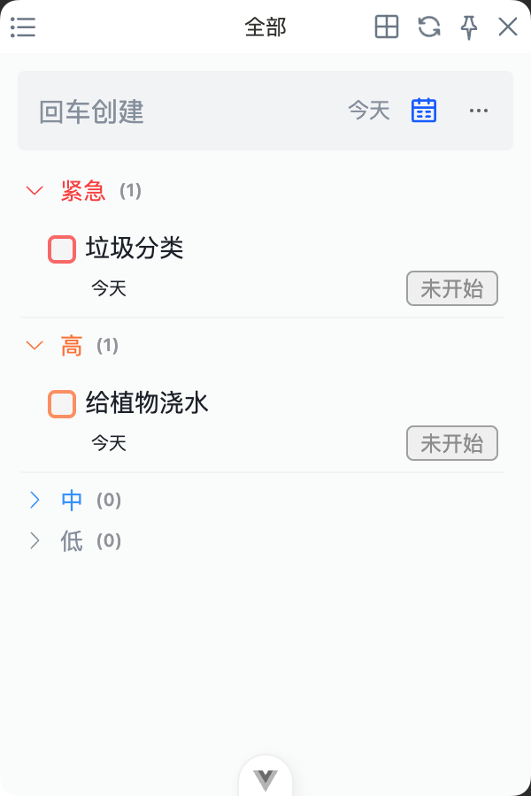
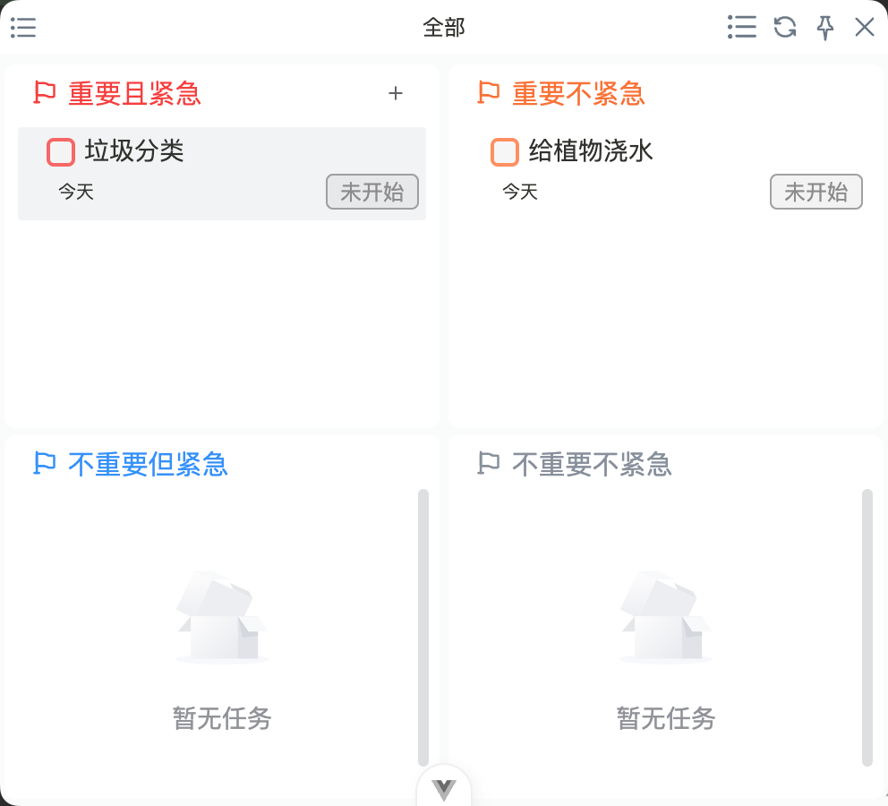

# 待办小组件

待办小组件用于在完整工作台之外快速查看任务。它适合需要持续关注当天任务，但不想频繁打开完整页面的场景。

## 适合什么时候使用

- 工作时希望任务列表保持在桌面附近。
- 只需要快速查看当前待办。
- 希望减少打开完整工作台的次数。
- 想在处理其他工作时保留任务提醒感。

## 常见操作

待办小组件通常适合做轻量操作，例如查看任务、切换任务范围或处理简单状态。复杂编辑仍建议回到完整待办页面。

适合在完整待办页面处理的操作：

- 编写较长任务描述。
- 设置复杂提醒或重复规则。
- 调整分组、标签和筛选器。
- 批量整理任务。

## 小组件与完整页面的关系

| 场景 | 建议入口 |
| --- | --- |
| 快速看今天还有什么 | 待办小组件 |
| 连续创建多个任务 | 完整待办页面 |
| 详细编辑任务内容 | 完整待办页面 |
| 工作中保持任务可见 | 待办小组件 |

## 使用建议

- 把小组件当成快速查看入口，不要把它当成完整任务管理页面。
- 如果发现需要频繁编辑任务，切回完整页面会更稳定。
- 小组件显示内容会受当前版本和窗口状态影响，以实际界面为准。
